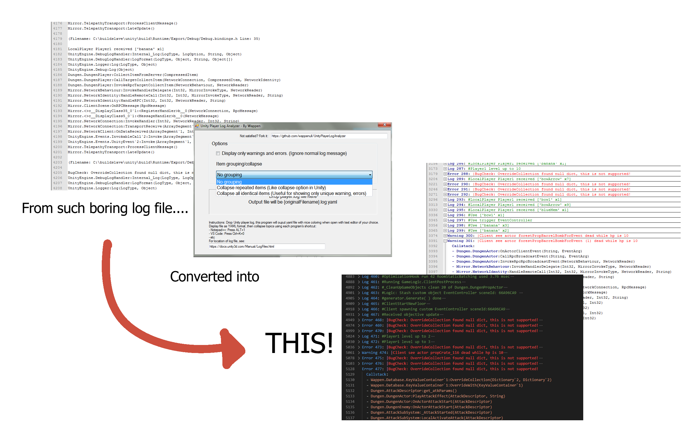

# UnityPlayerLogAnalyzer
Analyze player log output from standalone player and output to nice (fake) YAML format.
(It does not ouput legit YAML format, just take advantage of YAML color highlighting. So never use the output as really YAML!)

So when you do alpha or beta testing, you as developer get many log files from play testers.
This program will help you analyze these log files easier, with help of your favorite text editing program, of course!

## Abilty:
- Reinterpret log file into YAML which can collapse/expand node and most text editor has nice coloring.
- Remove normal message log entirely from input file, if you only interest in warning/error.
- Option to collapse or show only unique error line, even if such line appear 100 times it will be collapsed to one.

## Tested with text editor:
- VS Code
- Notepad++

(Not all caese are thoroughly tested, if you output nasty character or pattern to output message, it could mess up).

## Known Issues
The program will look for certain line to capture, but these keywords and function name change could internally by Unity over the releases. 
Such as `UnityEngine.DebugLogHandler:Internal_Log` 2019.4.19 becomes `StackTraceUtility:ExtractStackTrace` in 2019.4.26. 
I have included both keyword to the code. But have not yet test with any future version (Unity 2020)
If the program does not recognize log line for the version you are using, you might have to do a soft mod yourself.
